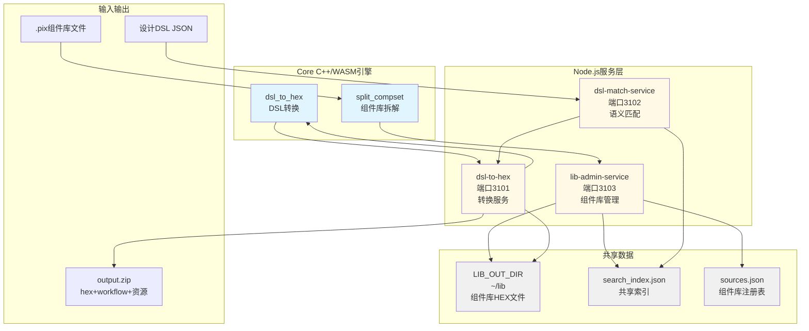
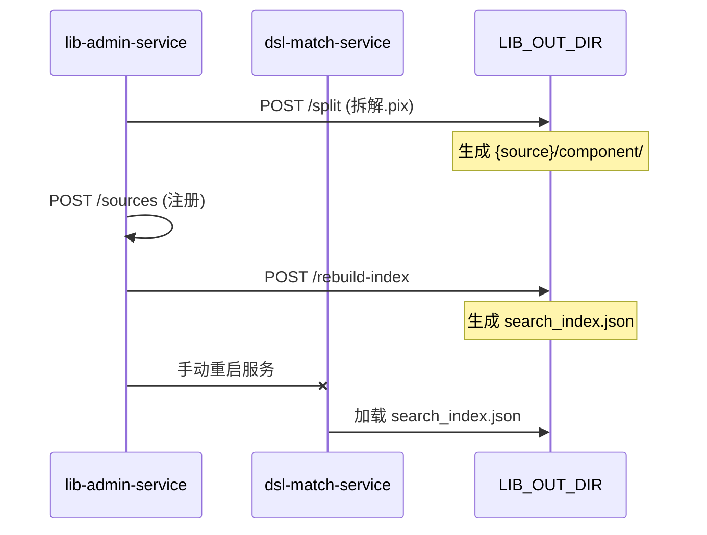
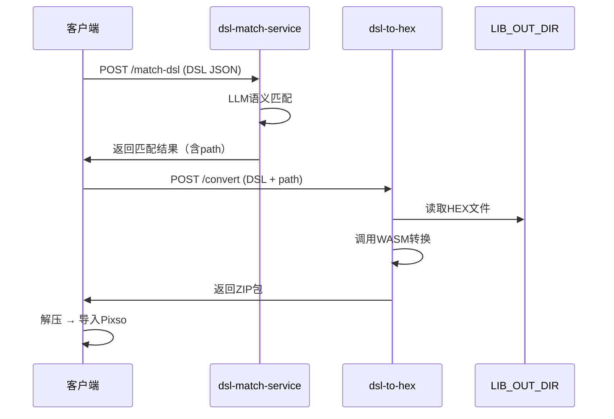
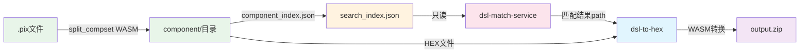
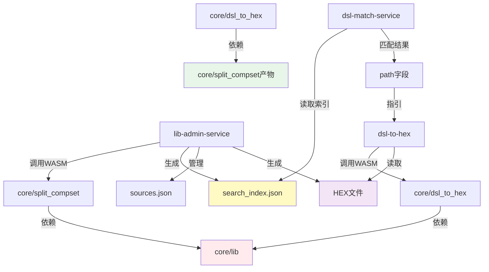
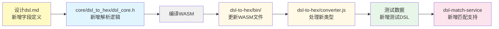
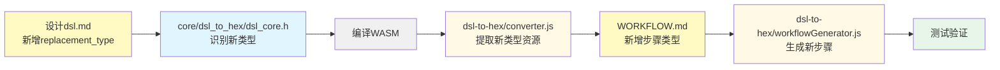
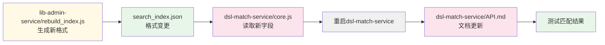
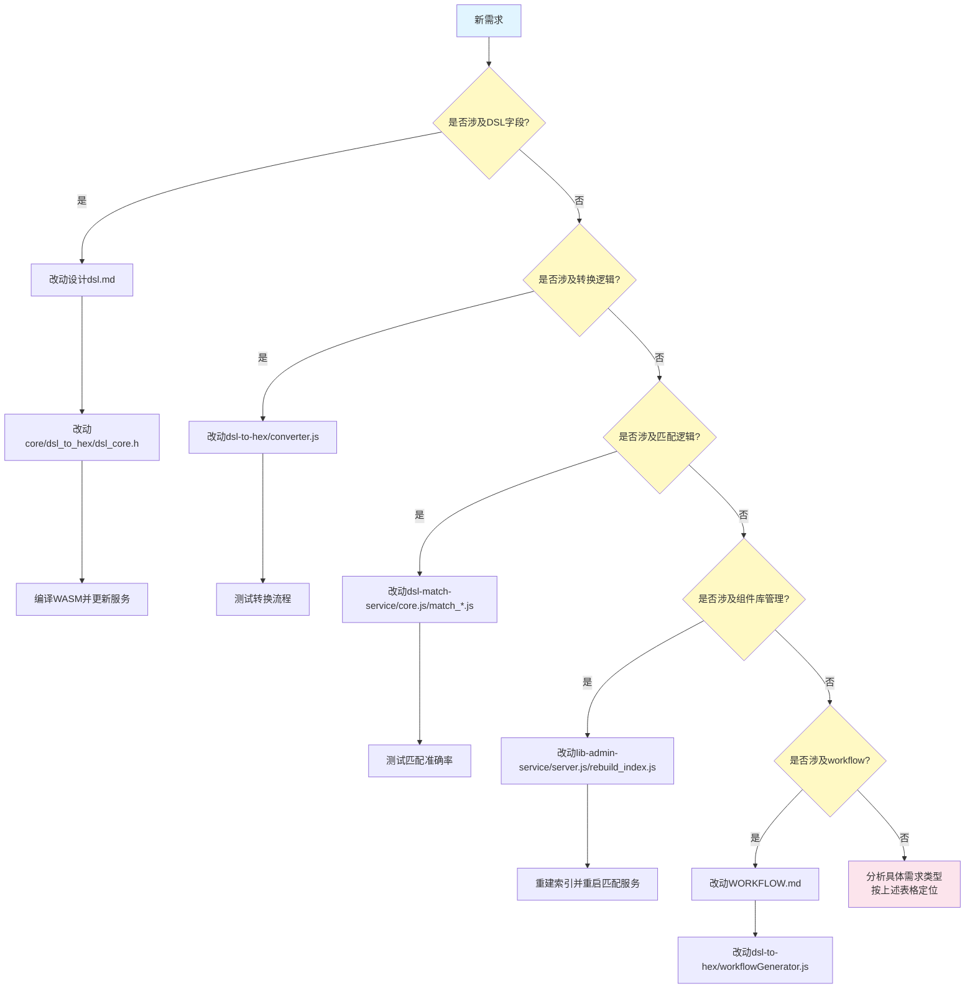

# 项目架构说明

## 概述

本项目实现从设计DSL到Pixso可导入HEX文件的完整转换链路，包含C++核心引擎和Node.js服务层。

**核心链路**：DSL生成 → 组件匹配 → HEX转换 → Pixso导入

## 架构总览



## 项目职责划分

### Core目录 - C++ WASM核心引擎

#### split_compset - 组件库拆解引擎

**职责**：将Pixso `.pix`组件库文件拆解为独立HEX文件

**核心能力**：
- CLI和WASM双版本（核心逻辑在`split_compset_core.h`）
- 解析.pix文件（zstd解压 → kiwi解码）
- 按组件集拆分，每个输出独立HEX文件
- 生成`component_index.json`索引文件
- 自洽性保证：每个HEX包含完整节点和blob数据

**产物**：
```
{output_dir}/component/
├── component_index.json       # 组件索引
├── {componentKey}.txt         # 组件集HEX文件
└── {sessionId_localId}.txt    # 未发布组件HEX
```

**详细文档**：`core/split_compset/README.md`

---

#### dsl_to_hex - DSL转HEX引擎

**职责**：将设计DSL JSON转换为Pixso可导入的HEX数据

**核心能力**：
- CLI和WASM双版本（核心逻辑在`dsl_core.h`）
- 解析DSL图层树，构建PixsoMsg
- 按component_set_key加载组件HEX并嵌入
- INSTANCE节点特殊处理（symbolData、derivedSymbolData）
- 支持placeholder图层（SVG/图片）

**输出格式**：
```
<!-- pixso binary data -->
706978736f2d6b7700020d636f6d70726573733a7a7374...
```

**详细文档**：`core/dsl_to_hex/README.md`

---

#### lib - 共享依赖库

**内容**：
- `pixso.h`：Pixso数据schema定义
- `kiwi-master/`：二进制序列化库
- `zstd-1.5.6/`：压缩库

---

### Node.js服务层

#### lib-admin-service (端口3103) - 组件库管理服务

**职责**：管理组件库生命周期，提供索引和HEX文件

**核心接口**：

| 接口 | 说明 |
|---|---|
| `POST /split` | 拆解.pix文件，调用split_compset WASM |
| `POST /sources` | 注册组件库到sources.json |
| `POST /rebuild-index` | 重建search_index.json并热重载 |
| `GET /hex/:key` | 提供HEX文件内容（跨组件库查找） |

**数据管理**：
- 组件库注册表：`sources.json`（服务内）
- 共享索引：`search_index.json`（LIB_OUT_DIR）
- 组件HEX文件：`LIB_OUT_DIR/{source}/component/`

**详细文档**：`lib-admin-service/API.md`、`lib-admin-service/ADDING_LIBRARIES.md`

---

#### dsl-match-service (端口3102) - 语义匹配服务

**职责**：基于LLM的语义化组件匹配

**核心接口**：

| 接口 | 说明 |
|---|---|
| `POST /match` | 单条组件匹配（LLM驱动） |
| `POST /batch` | 批量匹配（最多100条，5并发） |
| `POST /match-dsl` | DSL树自动匹配（整页统一裁决） |
| `POST /match-dsl-single` | 逐节点独立匹配（旧行为） |

**匹配流程**：
```
语义提取 → 本地过滤候选 → LLM选组件集 → LLM选变体
```

**返回结果**：包含`path`字段（相对LIB_OUT_DIR路径），供后续服务直接读取HEX文件

**依赖**：
- DeepSeek LLM API（配置在.env）
- 共享索引：`search_index.json`（只读）

**详细文档**：`dsl-match-service/API.md`

---

#### dsl-to-hex (端口3101) - 转换服务

**职责**：接收DSL JSON，调用WASM转换并打包

**核心接口**：

| 接口 | 说明 |
|---|---|
| `POST /convert` | DSL转HEX，返回ZIP包 |

**处理流程**：
```
扫描DSL → 读取组件HEX（本地文件） → 调用dsl_to_hex WASM → 打包ZIP
```

**ZIP内容**：
- `output.hex`：Pixso可导入HEX文件
- `workflow.json`：导入执行流程
- `{guid}.svg`/`{guid}.png`：placeholder资源文件

**特性**：
- 无外部npm依赖
- 支持IPC worker模式
- 本地文件优先（直接读取而非HTTP调用）

**详细文档**：`dsl-to-hex/API.md`、`dsl-to-hex/WORKER.md`

---

## 项目协作流程

### 流程1：新增组件库



### 流程2：设计稿转换



## 数据流依赖关系



## 共享数据目录结构

**LIB_OUT_DIR**（默认`~/lib`）：

```
~/lib/
├── search_index.json              # 共享索引（lib-admin-service生成）
├── ict-ui/                        # 组件库目录
│   └── component/
│       ├── component_index.json   # 该库索引
│       ├── {componentKey}.txt     # HEX文件
│       └── ...
├── h-design-chart/                # 其他组件库
│   └── component/
│       └── ...
└── h-design-light/
```

**关键约定**：
- `sources.json`中的`key`必须与`LIB_OUT_DIR/`下的目录名一致
- 匹配结果的`path`字段格式：`{source}/component/{hexFile}`
- 服务直接读取本地文件：`HEX_LIB_DIR + path`

## 配置要点

### lib-admin-service

| 变量 | 默认值 | 说明 |
|---|---|---|
| `PORT` | 3103 | 监听端口 |
| `LIB_OUT_DIR` | `~/lib` | 共享数据目录 |

### dsl-match-service

| 变量 | 默认值 | 说明 |
|---|---|---|
| `PORT` | 3102 | 监听端口 |
| `DASHSCOPE_API_KEY` | - | LLM密钥（必填） |
| `SEARCH_INDEX_PATH` | `~/lib/search_index.json` | 索引文件路径 |

### dsl-to-hex

| 变量 | 默认值 | 说明 |
|---|---|---|
| `PORT` | 3101 | 监听端口 |
| `HEX_LIB_DIR` | `~/lib` | 组件HEX根目录 |
| `WASM_PATH` | `./bin/dsl_to_hex.js` | WASM路径 |

## 关键设计决策

### 1. WASM架构

**优点**：
- C++核心逻辑高性能
- Node.js服务层易维护
- CLI和WASM双版本灵活

**实现**：
- 核心逻辑集中在`.h`头文件
- CLI入口和WASM入口分离
- Emscripten编译为WASM

### 2. 本地文件优先

**策略**：直接读取本地HEX文件，而非HTTP调用

**优点**：
- 更高性能（无网络开销）
- 减少服务间依赖
- 部署更简单

**实现**：
- 匹配结果包含`path`字段
- 服务拼接`HEX_LIB_DIR + path`直接读取

### 3. 共享索引机制

**设计**：
- `search_index.json`由lib-admin-service统一生成
- dsl-match-service只读该文件
- 避免数据冗余和不一致

**当前局限**：
- 索引更新需手动重启dsl-match-service
- TODO：实现自动监听机制

### 4. Placeholder处理

**机制**：
- DSL图层标记`placeholder`字段
- dsl-to-hex提取SVG/图片资源
- 打包到ZIP并生成workflow步骤
- 客户端按workflow执行替换

## DSL和Workflow规范

**DSL规范**：详见 `设计dsl.md`

**核心概念**：
- Meta：文件元信息
- Page：页面容器
- Layer：图层节点（NormalLayer / InstanceLayer）
- InstanceLayer：云端组件实例引用
- Placeholder：SVG/图片占位符

**Workflow规范**：详见 `WORKFLOW.md`

**核心步骤**：
- `import_hex`：导入HEX到Pixso
- `insert_svg`：替换SVG占位符
- `insert_image`：替换图片占位符

**执行策略**：
- 按order顺序执行
- depends_on为空可立即启动
- 多步骤可并行执行

## 典型使用场景

### 场景1：新增组件库

```bash
# 1. 拆解.pix文件
curl -X POST http://localhost:3103/split \
  -F "file=@library.pix" \
  -F "source=h-design-new"

# 2. 注册组件库
curl -X POST http://localhost:3103/sources \
  -H "Content-Type: application/json" \
  -d '{ "key": "h-design-new", "label": "新组件库" }'

# 3. 重建索引
curl -X POST http://localhost:3103/rebuild-index

# 4. 重启匹配服务
pkill -f "node.*dsl-match-service"
cd ~/nodejs/dsl-match-service && node server.js
```

### 场景2：设计稿转换

```bash
# 1. 匹配DSL中的组件
curl -X POST http://localhost:3102/match-dsl \
  -F "file=@design.dsl.json"

# 2. 转换为HEX
curl -X POST http://localhost:3101/convert \
  -H "Content-Type: application/json" \
  -d '{ "dsl": {...} }' \
  | jq -r '.zip' | base64 -d > output.zip

# 3. 解压导入
unzip output.zip
# 执行workflow.json中的步骤导入Pixso
```

## 技术栈总结

| 层级 | 技术 | 用途 |
|---|---|---|
| Core引擎 | C++ / Emscripten | WASM核心转换逻辑 |
| 服务层 | Node.js / Express | HTTP API服务 |
| 语义匹配 | DeepSeek LLM | 自然语言组件匹配 |
| 序列化 | Kiwi | Pixso二进制格式 |
| 压缩 | Zstd | 高效压缩算法 |
| 数据格式 | Pixso HEX | 可导入文件格式 |

## 项目依赖关系图



## TODO和未来规划

| 服务 | TODO |
|---|---|
| lib-admin-service | - 自动监听索引变更并通知<br/>- DELETE /sources/:key<br/>- 组件库版本管理 |
| dsl-match-service | - 自动重新加载索引<br/>- 匹配结果缓存<br/>- 匹配历史记录 |
| dsl-to-hex | - 转换性能优化<br/>- 大文件处理支持 |

---

## 需求改动指南

通过以下表格可快速定位新需求对应的改动位置。

### 典型需求场景映射表

#### Core引擎改动（需重新编译WASM）

| 需求类型 | 改动位置 | 影响范围 | 编译命令 |
|---|---|---|---|
| 新增DSL字段解析 | `core/dsl_to_hex/dsl_core.h` | dsl-to-hex服务 + 文档 | `cd core/dsl_to_hex && make -f Makefile.wasm` |
| 新增图层类型 | `core/dsl_to_hex/dsl_core.h` | dsl-to-hex服务 + DSL文档 | 同上 |
| 优化HEX转换性能 | `core/dsl_to_hex/dsl_core.h` | dsl-to-hex服务性能 | 同上 |
| 新增Pixso字段支持 | `core/lib/pixso.h` | 所有依赖项目 | 无需单独编译（被其他项目引用） |
| 新增.pix解析逻辑 | `core/split_compset/split_compset_core.h` | lib-admin-service | `cd core/split_compset && make -f Makefile.wasm` |
| 优化组件拆解逻辑 | `core/split_compset/split_compset_core.h` | lib-admin-service性能 | 同上 |
| 新增placeholder类型 | `core/dsl_to_hex/dsl_core.h` + `dsl-to-hex/converter.js` | 转换服务 + 文档 | WASM编译 + JS改动 |

**关键提示**：
- Core改动需同步更新WASM文件到对应服务的`bin/`目录
- 改动`dsl_core.h`或`split_compset_core.h`后，CLI和WASM版本自动同步
- 改动后需测试：CLI版本 → WASM版本 → 服务集成

---

#### 服务层改动

| 需求类型 | 改动位置 | 影响范围 | 文档更新 |
|---|---|---|---|
| 新增匹配接口 | `dsl-match-service/server.js` | 新增HTTP端点 | `dsl-match-service/API.md` |
| 优化匹配算法 | `dsl-match-service/match_variant.js` | 匹配准确率/性能 | 无需更新文档（内部优化） |
| 新增语义节点类型 | `dsl-match-service/match_dsl.js` | `/match-dsl`接口 | `dsl-match-service/API.md` |
| 新增LLM调用策略 | `dsl-match-service/core.js` | 匹配流程/超时 | `dsl-match-service/API.md` + `.env` |
| 新增组件库管理接口 | `lib-admin-service/server.js` | 新增HTTP端点 | `lib-admin-service/API.md` |
| 索引结构变更 | `lib-admin-service/rebuild_index.js` | search_index.json格式 | `lib-admin-service/API.md` + `dsl-match-service/core.js` |
| 新增拆解参数 | `lib-admin-service/split_lib.js` | `/split`接口行为 | `lib-admin-service/API.md` + `ADDING_LIBRARIES.md` |
| 新增转换功能 | `dsl-to-hex/server.js` | 新增HTTP端点 | `dsl-to-hex/API.md` |
| 优化转换流程 | `dsl-to-hex/converter.js` | ZIP生成逻辑 | 无需更新文档 |
| 新增workflow步骤类型 | `dsl-to-hex/workflowGenerator.js` | workflow.json格式 | `WORKFLOW.md` |

**关键提示**：
- 服务改动需重启对应服务生效
- 改动接口需同步更新API.md文档
- 改动核心逻辑需编写单元测试

---

#### 数据和文档改动

| 需求类型 | 改动位置 | 影响范围 | 同步改动 |
|---|---|---|---|
| DSL字段新增 | `设计dsl.md` | DSL规范 + 转换引擎 | `core/dsl_to_hex/dsl_core.h` + 测试数据 |
| DSL字段废弃 | `设计dsl.md` | DSL规范 + 转换引擎 | `core/dsl_to_hex/dsl_core.h`（移除解析逻辑） |
| Workflow步骤新增 | `WORKFLOW.md` | workflow规范 + 生成逻辑 | `dsl-to-hex/workflowGenerator.js` |
| 索引结构调整 | `search_index.json`格式 | 索引生成 + 读取 | `lib-admin-service/rebuild_index.js` + `dsl-match-service/core.js` |
| sources.json格式变更 | `lib-admin-service/sources.json` | 组件库注册表 | `lib-admin-service/server.js` |

**关键提示**：
- DSL字段改动需向后兼容（旧DSL仍可解析）
- 文档改动需标注版本号和变更日期

---

### 跨项目改动分析

以下需求涉及多个项目，需按顺序改动：

#### 1. 新增组件类型完整流程

**需求描述**：支持新的组件类型（如`video`、`map`）

**改动顺序**：



**改动清单**：
1. `设计dsl.md`：新增LayerType定义、字段说明
2. `core/dsl_to_hex/dsl_core.h`：新增解析逻辑、PixsoMsg构建
3. 编译WASM：`cd core/dsl_to_hex && make -f Makefile.wasm`
4. `dsl-to-hex/bin/dsl_to_hex.js/wasm`：更新编译产物
5. `dsl-to-hex/converter.js`：如有placeholder需处理
6. 测试数据：`test-dsl.json`或`core/dsl_to_hex/test_data/`
7. `dsl-match-service/match_dsl.js`：如需语义匹配支持

---

#### 2. 新增placeholder类型流程

**需求描述**：支持新的placeholder类型（如`video`、`audio`）

**改动顺序**：



**改动清单**：
1. `设计dsl.md`：`PlaceholderMeta.replacement_type`新增类型
2. `core/dsl_to_hex/dsl_core.h`：识别并标记新类型
3. 编译WASM
4. `dsl-to-hex/converter.js`：提取资源并解码（如base64）
5. `WORKFLOW.md`：新增步骤类型（如`insert_video`）
6. `dsl-to-hex/workflowGenerator.js`：生成对应workflow步骤
7. 测试：准备含新placeholder的DSL

---

#### 3. 新增LLM匹配策略流程

**需求描述**：优化匹配算法（如新增过滤策略、调整prompt）

**改动顺序**：

```
dsl-match-service/core.js（LLM调用策略）
    ↓
dsl-match-service/match_variant.js（过滤逻辑）
    ↓
dsl-match-service/match_dsl.js（DSL匹配逻辑）
    ↓
测试验证（准备匹配测试数据）
    ↓
性能调优（调整.env超时配置）
```

**改动清单**：
1. `dsl-match-service/core.js`：调整LLM调用次数、prompt模板
2. `dsl-match-service/match_variant.js`：新增候选过滤逻辑
3. `dsl-match-service/match_dsl.js`：调整语义提取规则
4. `.env`：调整`LLM_TIMEOUT_MS`、`MODEL`等配置
5. 测试：验证匹配准确率和性能

---

#### 4. 索引结构变更流程

**需求描述**：调整search_index.json格式（如新增字段）

**改动顺序**：



**改动清单**：
1. `lib-admin-service/rebuild_index.js`：生成时新增字段
2. `lib-admin-service/API.md`：更新索引结构说明
3. `dsl-match-service/core.js`：加载时读取新字段
4. 重启`dsl-match-service`生效
5. `dsl-match-service/API.md`：更新返回结果字段说明
6. 测试：验证匹配结果包含新字段

---

### 改动影响范围速查

| 改动起点 | 直接影响 | 间接影响 | 需同步改动 |
|---|---|---|---|
| `core/dsl_to_hex/dsl_core.h` | dsl-to-hex服务 | DSL文档、测试数据 | WASM编译、API文档 |
| `core/split_compset/split_compset_core.h` | lib-admin-service | 组件库拆解产物 | WASM编译、API文档 |
| `core/lib/pixso.h` | 所有Core项目 | Pixso格式兼容性 | 无需单独编译 |
| `dsl-match-service/core.js` | 匹配准确率/性能 | LLM成本、超时配置 | API文档、环境变量 |
| `lib-admin-service/rebuild_index.js` | 索引格式 | dsl-match-service读取 | API文档、匹配服务代码 |
| `dsl-to-hex/workflowGenerator.js` | workflow.json格式 | 客户端执行逻辑 | WORKFLOW.md |
| `设计dsl.md` | DSL规范 | 转换引擎、测试数据 | `core/dsl_to_hex/dsl_core.h` |
| `WORKFLOW.md` | workflow规范 | workflow生成逻辑 | `dsl-to-hex/workflowGenerator.js` |

---

### 测试验证建议

#### Core改动测试流程

```bash
# 1. 编译CLI版本测试
cd core/dsl_to_hex && make
./bin/dsl_to_hex test_data/test.dsl.json test_out.txt ~/lib

# 2. 编译WASM版本测试
make -f Makefile.wasm
node index.js test_data/test.dsl.json ~/lib

# 3. 更新到服务并测试
cp bin/dsl_to_hex.js ../../dsl-to-hex/bin/
cp bin/dsl_to_hex.wasm ../../dsl-to-hex/bin/
cd ../../dsl-to-hex
curl -X POST http://localhost:3101/convert -d '{"dsl":...}'
```

---

#### 服务改动测试流程

```bash
# 1. 重启服务
pkill -f "node.*dsl-match-service/server.js"
cd ~/nodejs/dsl-match-service && node server.js

# 2. 测试接口
curl http://localhost:3102/health
curl -X POST http://localhost:3102/match -d '{"description":"主按钮"}'

# 3. 查看日志（如有）
tail -f server.log
```

---

#### DSL字段改动测试流程

```bash
# 1. 准备测试DSL（包含新字段）
cat test-new-field.dsl.json

# 2. 测试转换
curl -X POST http://localhost:3101/convert \
  -F "dsl=@test-new-field.dsl.json"

# 3. 验证输出
unzip output.zip
cat workflow.json
# 检查新字段是否正确处理
```

---

### 改动决策树

遇到新需求时，按以下流程判断改动范围：



---

### 快速定位清单

**按需求关键词定位改动位置**：

- **"新增字段"** → `设计dsl.md` + `core/dsl_to_hex/dsl_core.h`
- **"新增图层类型"** → `设计dsl.md` + `core/dsl_to_hex/dsl_core.h`
- **"新增placeholder类型"** → `设计dsl.md` + `core/dsl_to_hex/dsl_core.h` + `dsl-to-hex/converter.js` + `WORKFLOW.md`
- **"优化转换性能"** → `core/dsl_to_hex/dsl_core.h` + WASM编译
- **"新增匹配接口"** → `dsl-match-service/server.js` + `API.md`
- **"优化匹配算法"** → `dsl-match-service/core.js` + `match_variant.js`
- **"新增组件库管理功能"** → `lib-admin-service/server.js` + `API.md`
- **"索引格式变更"** → `lib-admin-service/rebuild_index.js` + `dsl-match-service/core.js`
- **"workflow步骤新增"** → `WORKFLOW.md` + `dsl-to-hex/workflowGenerator.js`
- **"Pixso格式兼容"** → `core/lib/pixso.h` + 所有Core项目重编译

---

**相关详细文档**：
- DSL规范：`设计dsl.md`
- Workflow规范：`WORKFLOW.md`
- Core引擎：`core/*/README.md`
- 服务API：`*/API.md`、`*/WORKER.md`
- 新增组件库：`lib-admin-service/ADDING_LIBRARIES.md`