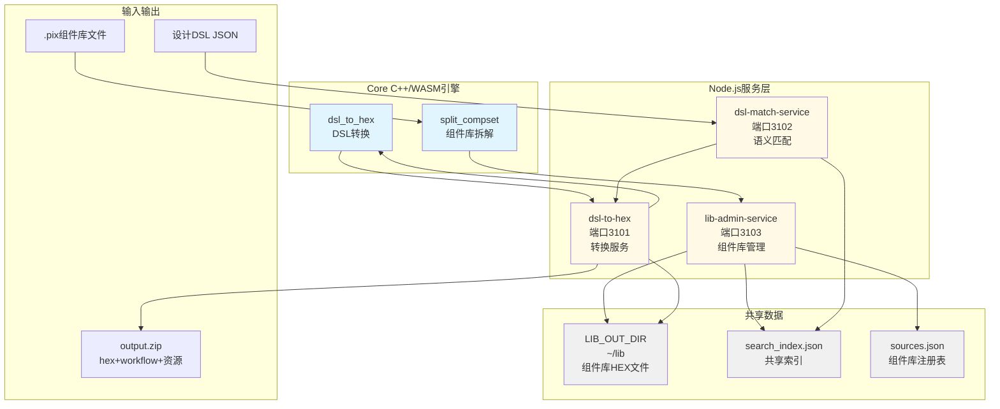
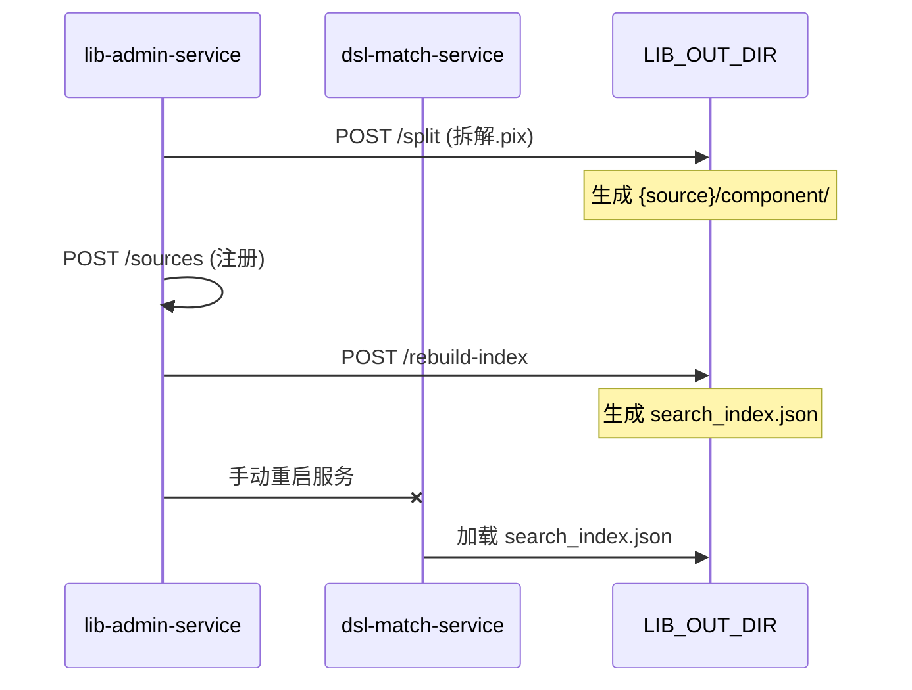
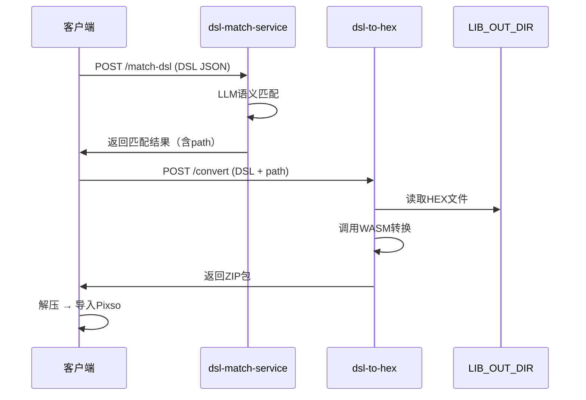
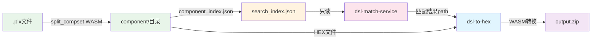
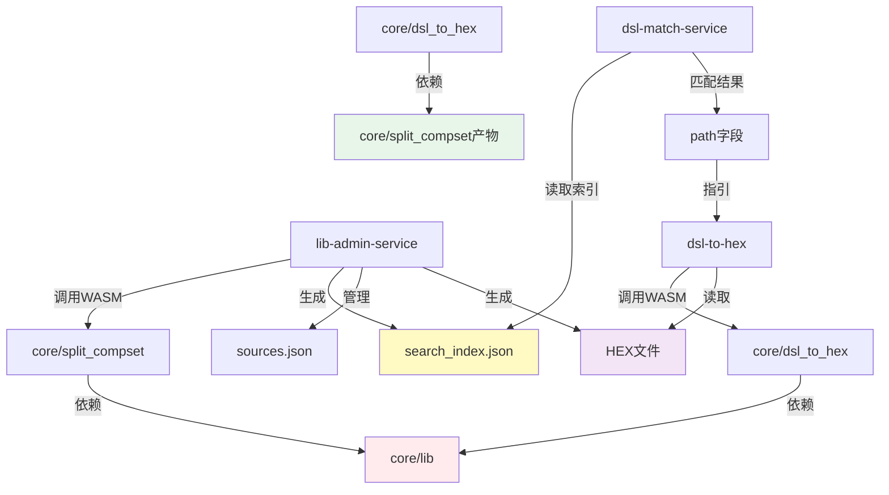

# 项目架构说明

## 概述

本项目实现从设计DSL到Pixso可导入HEX文件的完整转换链路，包含C++核心引擎和Node.js服务层。

**核心链路**：DSL生成 → 组件匹配 → HEX转换 → Pixso导入

## 架构总览



## 项目职责划分

### Core目录 - C++ WASM核心引擎

#### split_compset - 组件库拆解引擎

**职责**：将Pixso `.pix`组件库文件拆解为独立HEX文件

**核心能力**：
- CLI和WASM双版本（核心逻辑在`split_compset_core.h`）
- 解析.pix文件（zstd解压 → kiwi解码）
- 按组件集拆分，每个输出独立HEX文件
- 生成`component_index.json`索引文件
- 自洽性保证：每个HEX包含完整节点和blob数据

**产物**：
```
{output_dir}/component/
├── component_index.json       # 组件索引
├── {componentKey}.txt         # 组件集HEX文件
└── {sessionId_localId}.txt    # 未发布组件HEX
```

**详细文档**：`core/split_compset/README.md`

---

#### dsl_to_hex - DSL转HEX引擎

**职责**：将设计DSL JSON转换为Pixso可导入的HEX数据

**核心能力**：
- CLI和WASM双版本（核心逻辑在`dsl_core.h`）
- 解析DSL图层树，构建PixsoMsg
- 按component_set_key加载组件HEX并嵌入
- INSTANCE节点特殊处理（symbolData、derivedSymbolData）
- 支持placeholder图层（SVG/图片）

**输出格式**：
```
<!-- pixso binary data -->
706978736f2d6b7700020d636f6d70726573733a7a7374...
```

**详细文档**：`core/dsl_to_hex/README.md`

---

#### lib - 共享依赖库

**内容**：
- `pixso.h`：Pixso数据schema定义
- `kiwi-master/`：二进制序列化库
- `zstd-1.5.6/`：压缩库

---

### Node.js服务层

#### lib-admin-service (端口3103) - 组件库管理服务

**职责**：管理组件库生命周期，提供索引和HEX文件

**核心接口**：

| 接口 | 说明 |
|---|---|
| `POST /split` | 拆解.pix文件，调用split_compset WASM |
| `POST /sources` | 注册组件库到sources.json |
| `POST /rebuild-index` | 重建search_index.json并热重载 |
| `GET /hex/:key` | 提供HEX文件内容（跨组件库查找） |

**数据管理**：
- 组件库注册表：`sources.json`（服务内）
- 共享索引：`search_index.json`（LIB_OUT_DIR）
- 组件HEX文件：`LIB_OUT_DIR/{source}/component/`

**详细文档**：`lib-admin-service/API.md`、`lib-admin-service/ADDING_LIBRARIES.md`

---

#### dsl-match-service (端口3102) - 语义匹配服务

**职责**：基于LLM的语义化组件匹配

**核心接口**：

| 接口 | 说明 |
|---|---|
| `POST /match` | 单条组件匹配（LLM驱动） |
| `POST /batch` | 批量匹配（最多100条，5并发） |
| `POST /match-dsl` | DSL树自动匹配（整页统一裁决） |
| `POST /match-dsl-single` | 逐节点独立匹配（旧行为） |

**匹配流程**：
```
语义提取 → 本地过滤候选 → LLM选组件集 → LLM选变体
```

**返回结果**：包含`path`字段（相对LIB_OUT_DIR路径），供后续服务直接读取HEX文件

**依赖**：
- DeepSeek LLM API（配置在.env）
- 共享索引：`search_index.json`（只读）

**详细文档**：`dsl-match-service/API.md`

---

#### dsl-to-hex (端口3101) - 转换服务

**职责**：接收DSL JSON，调用WASM转换并打包

**核心接口**：

| 接口 | 说明 |
|---|---|
| `POST /convert` | DSL转HEX，返回ZIP包 |

**处理流程**：
```
扫描DSL → 读取组件HEX（本地文件） → 调用dsl_to_hex WASM → 打包ZIP
```

**ZIP内容**：
- `output.hex`：Pixso可导入HEX文件
- `workflow.json`：导入执行流程
- `{guid}.svg`/`{guid}.png`：placeholder资源文件

**特性**：
- 无外部npm依赖
- 支持IPC worker模式
- 本地文件优先（直接读取而非HTTP调用）

**详细文档**：`dsl-to-hex/API.md`、`dsl-to-hex/WORKER.md`

---

## 项目协作流程

### 流程1：新增组件库



### 流程2：设计稿转换



## 数据流依赖关系



## 共享数据目录结构

**LIB_OUT_DIR**（默认`~/lib`）：

```
~/lib/
├── search_index.json              # 共享索引（lib-admin-service生成）
├── ict-ui/                        # 组件库目录
│   └── component/
│       ├── component_index.json   # 该库索引
│       ├── {componentKey}.txt     # HEX文件
│       └── ...
├── h-design-chart/                # 其他组件库
│   └── component/
│       └── ...
└── h-design-light/
```

**关键约定**：
- `sources.json`中的`key`必须与`LIB_OUT_DIR/`下的目录名一致
- 匹配结果的`path`字段格式：`{source}/component/{hexFile}`
- 服务直接读取本地文件：`HEX_LIB_DIR + path`

## 配置要点

### lib-admin-service

| 变量 | 默认值 | 说明 |
|---|---|---|
| `PORT` | 3103 | 监听端口 |
| `LIB_OUT_DIR` | `~/lib` | 共享数据目录 |

### dsl-match-service

| 变量 | 默认值 | 说明 |
|---|---|---|
| `PORT` | 3102 | 监听端口 |
| `DASHSCOPE_API_KEY` | - | LLM密钥（必填） |
| `SEARCH_INDEX_PATH` | `~/lib/search_index.json` | 索引文件路径 |

### dsl-to-hex

| 变量 | 默认值 | 说明 |
|---|---|---|
| `PORT` | 3101 | 监听端口 |
| `HEX_LIB_DIR` | `~/lib` | 组件HEX根目录 |
| `WASM_PATH` | `./bin/dsl_to_hex.js` | WASM路径 |

## 关键设计决策

### 1. WASM架构

**优点**：
- C++核心逻辑高性能
- Node.js服务层易维护
- CLI和WASM双版本灵活

**实现**：
- 核心逻辑集中在`.h`头文件
- CLI入口和WASM入口分离
- Emscripten编译为WASM

### 2. 本地文件优先

**策略**：直接读取本地HEX文件，而非HTTP调用

**优点**：
- 更高性能（无网络开销）
- 减少服务间依赖
- 部署更简单

**实现**：
- 匹配结果包含`path`字段
- 服务拼接`HEX_LIB_DIR + path`直接读取

### 3. 共享索引机制

**设计**：
- `search_index.json`由lib-admin-service统一生成
- dsl-match-service只读该文件
- 避免数据冗余和不一致

**当前局限**：
- 索引更新需手动重启dsl-match-service
- TODO：实现自动监听机制

### 4. Placeholder处理

**机制**：
- DSL图层标记`placeholder`字段
- dsl-to-hex提取SVG/图片资源
- 打包到ZIP并生成workflow步骤
- 客户端按workflow执行替换

## DSL和Workflow规范

**DSL规范**：详见 `设计dsl.md`

**核心概念**：
- Meta：文件元信息
- Page：页面容器
- Layer：图层节点（NormalLayer / InstanceLayer）
- InstanceLayer：云端组件实例引用
- Placeholder：SVG/图片占位符

**Workflow规范**：详见 `WORKFLOW.md`

**核心步骤**：
- `import_hex`：导入HEX到Pixso
- `insert_svg`：替换SVG占位符
- `insert_image`：替换图片占位符

**执行策略**：
- 按order顺序执行
- depends_on为空可立即启动
- 多步骤可并行执行

## 典型使用场景

### 场景1：新增组件库

```bash
# 1. 拆解.pix文件
curl -X POST http://localhost:3103/split \
  -F "file=@library.pix" \
  -F "source=h-design-new"

# 2. 注册组件库
curl -X POST http://localhost:3103/sources \
  -H "Content-Type: application/json" \
  -d '{ "key": "h-design-new", "label": "新组件库" }'

# 3. 重建索引
curl -X POST http://localhost:3103/rebuild-index

# 4. 重启匹配服务
pkill -f "node.*dsl-match-service"
cd ~/nodejs/dsl-match-service && node server.js
```

### 场景2：设计稿转换

```bash
# 1. 匹配DSL中的组件
curl -X POST http://localhost:3102/match-dsl \
  -F "file=@design.dsl.json"

# 2. 转换为HEX
curl -X POST http://localhost:3101/convert \
  -H "Content-Type: application/json" \
  -d '{ "dsl": {...} }' \
  | jq -r '.zip' | base64 -d > output.zip

# 3. 解压导入
unzip output.zip
# 执行workflow.json中的步骤导入Pixso
```

## 技术栈总结

| 层级 | 技术 | 用途 |
|---|---|---|
| Core引擎 | C++ / Emscripten | WASM核心转换逻辑 |
| 服务层 | Node.js / Express | HTTP API服务 |
| 语义匹配 | DeepSeek LLM | 自然语言组件匹配 |
| 序列化 | Kiwi | Pixso二进制格式 |
| 压缩 | Zstd | 高效压缩算法 |
| 数据格式 | Pixso HEX | 可导入文件格式 |

## 项目依赖关系图



## TODO和未来规划

| 服务 | TODO |
|---|---|
| lib-admin-service | - 自动监听索引变更并通知<br/>- DELETE /sources/:key<br/>- 组件库版本管理 |
| dsl-match-service | - 自动重新加载索引<br/>- 匹配结果缓存<br/>- 匹配历史记录 |
| dsl-to-hex | - 转换性能优化<br/>- 大文件处理支持 |

---

**相关详细文档**：
- DSL规范：`设计dsl.md`
- Workflow规范：`WORKFLOW.md`
- Core引擎：`core/*/README.md`
- 服务API：`*/API.md`、`*/WORKER.md`
- 新增组件库：`lib-admin-service/ADDING_LIBRARIES.md`